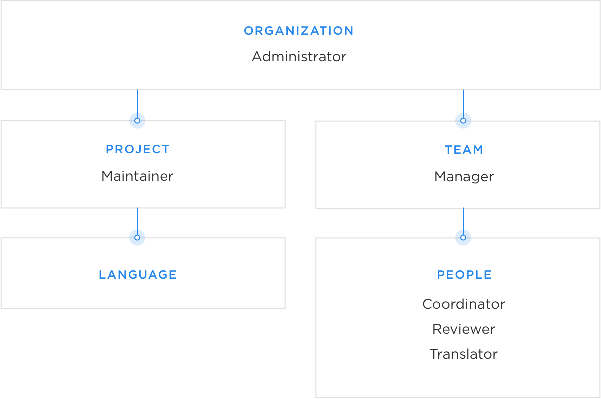

# 👥 User Roles and Access in Transifex

Transifex supports six user roles, each with a specific set of responsibilities and permissions. Understanding these roles helps ensure a smooth workflow and proper access control in your localization projects.

Below are details about the user permissions associated with each role. For more comprehensive information, please refer to the official guide:
🔗 [Understanding User Roles – Transifex Help](https://help.transifex.com/en/articles/6223416-understanding-user-roles)

---

## 🛡️ Organization Administrator

**Admins** have full control over all organization settings and permissions. They can perform all actions that other roles can, plus:

- Create and delete projects
- Add or remove project maintainers
- Invite users from any role
- Create and delete teams
- Assign projects to different teams
- Archive projects
- Delete the organization

---

## 📦 Project Maintainer

**Maintainers** manage individual projects within Transifex. Their permissions include:

- Add or remove project languages
- Approve or deny language requests
- Add or delete resources
- Invite or remove other project maintainers
- Change project-level settings
- Submit, review, and proofread translations in all project languages

---

## 👨‍👩‍👧‍👦 Team Manager

**Team Managers** manage teams and member roles. They can:

- Invite users to a team
- Approve or deny team join requests
- Change the roles of team members
- Submit, review, and proofread translations

---

## 🌐 Language Coordinator

**Language Coordinators** oversee a specific language within a team. They have similar permissions as Team Managers but limited to their assigned language:

- Invite users to a specific language team
- Approve or deny join requests for a language
- Change user roles within that language
- Submit, review, and proofread translations for that language

---

## 📝 Reviewer

**Reviewers** are responsible for quality assurance. Once they review a translation, it becomes locked for editing by translators. They can:

- Submit, review, and proofread translations in a specific language

---

## ✍️ Translator

**Translators** adapt content into another language. They can:

- Submit translations in a specific language
- Participate in team discussions

---

## 🧾 Notes

- Only **Team Managers**, **Language Coordinators**, **Reviewers**, and **Translators** are considered part of **teams** in Transifex.
- **Admins** and **Maintainers** work on an organization and project level, respectively.

---

◀️ [Previous: Transifex API Token Generation](./transifex-token-generation.md)

▶️ [Next: Fixing Transifex Resource Names for Open edX](./fix-transifex-resource-names-for-openedx.md)
